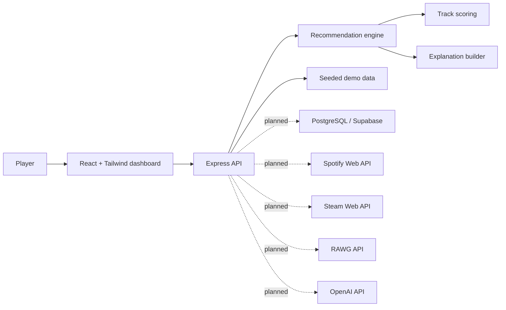

# Architecture

## Current MVP

The MVP is intentionally demo-friendly:

- React web app calls an Express API.
- Express exposes dashboard, game library, playlist, and recommendation routes.
- Seeded data simulates Spotify track metadata, Steam library data, RAWG game metadata, and saved playlists.
- The recommendation engine is deterministic and covered by unit tests, making it easy to explain and verify.
- Prisma schema documents the PostgreSQL/Supabase production model.

## Recommendation Flow

1. User enters a game and natural-language prompt.
2. API validates the request with Zod.
3. Engine matches the game profile from the catalogue.
4. Engine infers mood, session style, time of day, and target intensity.
5. Tracks are scored against mood tags, game genres, energy distance, valence, and time-of-day fit.
6. API returns playlist tracks and an explainable recommendation summary.

## Production Data Model

The Prisma schema supports:

- Users and service connections.
- Games with RAWG and Steam identifiers.
- Game library entries with playtime and achievement data.
- Tracks with Spotify URI and audio features.
- Recommendations and playlists.
- Playlist items for ordered track lists.

## Integration Boundaries

- Spotify: OAuth, audio features, track search, playlist creation, playback control.
- Steam: owned games, playtime, achievements, profile stats.
- RAWG: game search, genres, platforms, release dates, cover metadata.
- OpenAI: explanation generation, prompt parsing, and future RAG over user history.
- Supabase/PostgreSQL: auth, persistence, row-level security, and dashboard queries.
